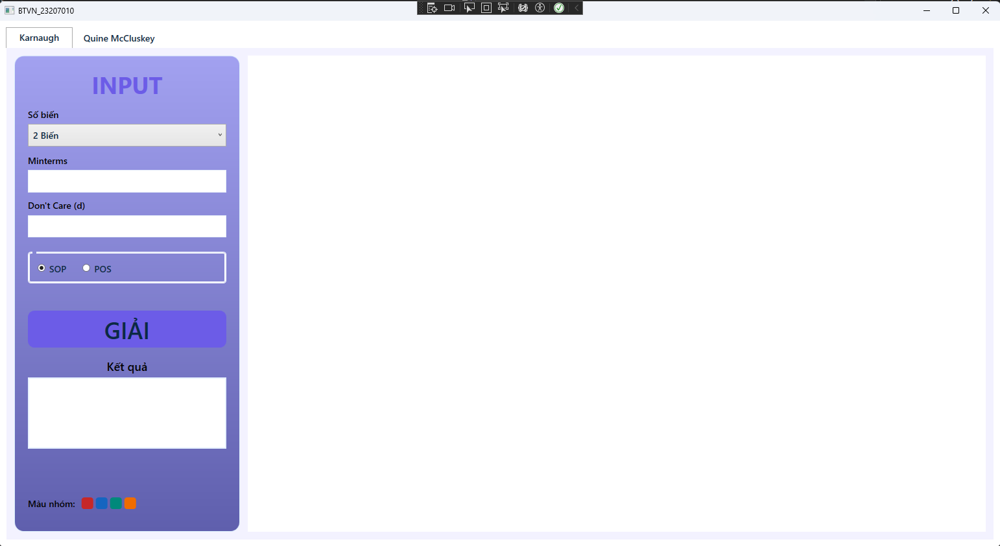
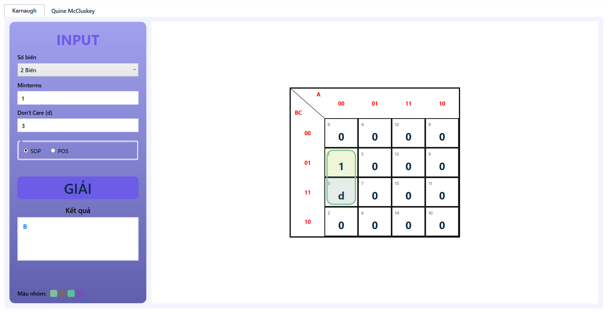
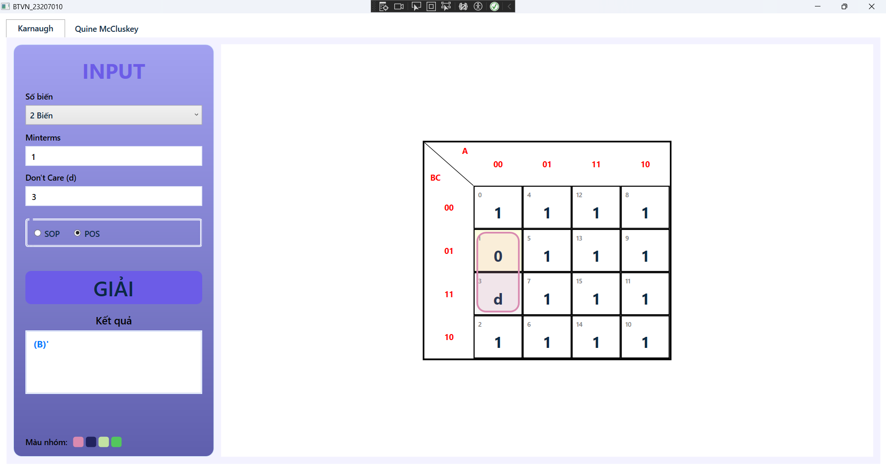
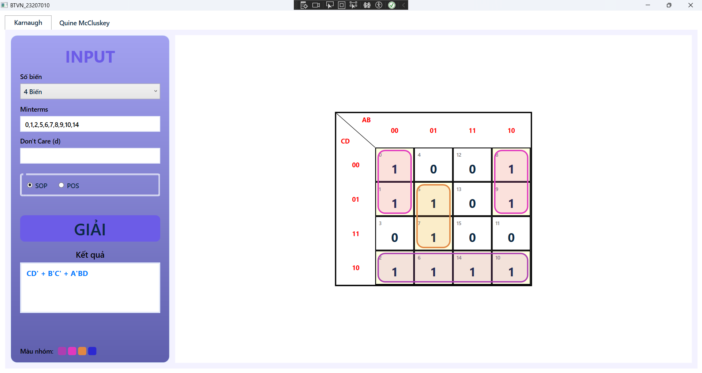
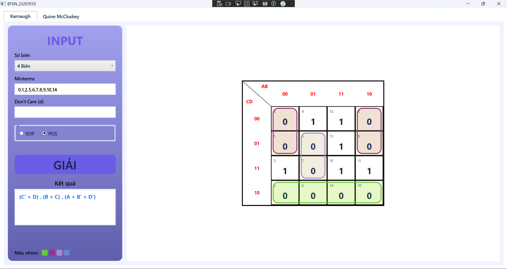
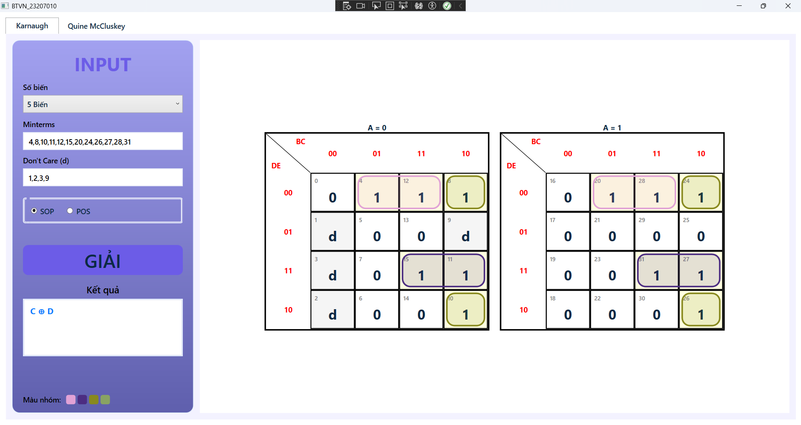
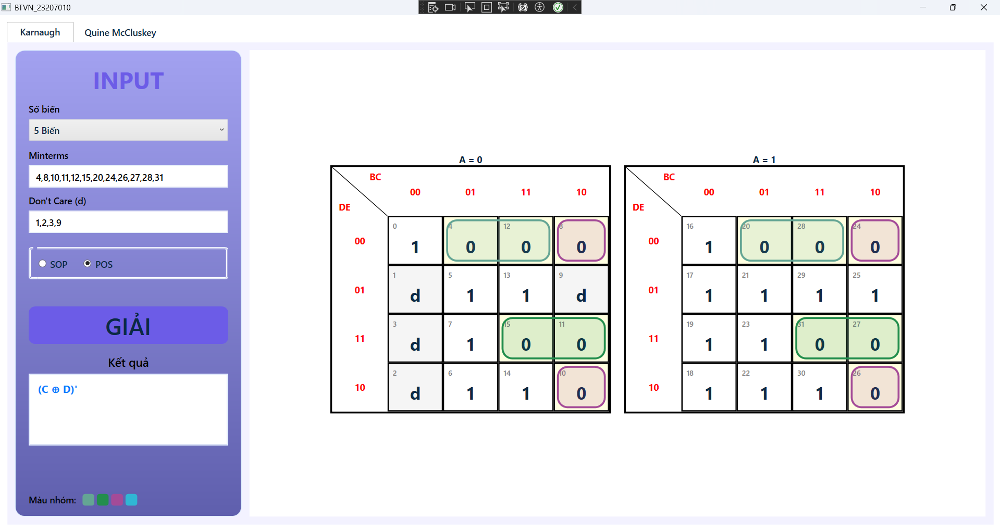
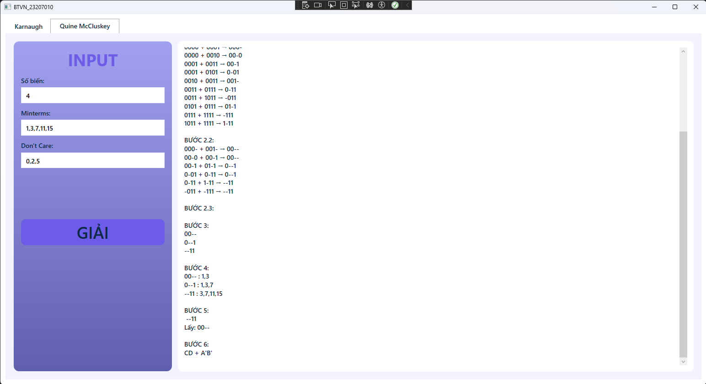
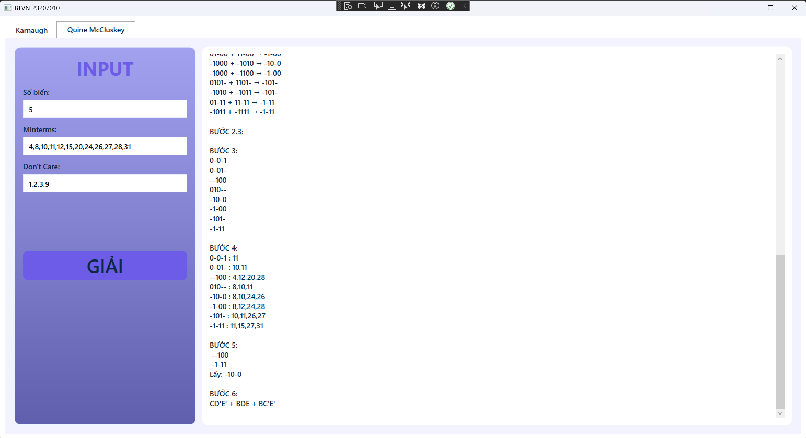
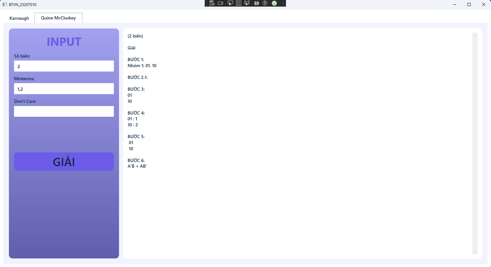

# Karnaugh Map Exercise Solving App

Ứng dụng giải bài tập bản đồ Karnaugh (K-map) hỗ trợ từ 2 đến 5 biến.

## Tính năng chính
- Giải các biểu thức Logic bằng bản đồ Karnaugh.
- Hỗ trợ tối giản hóa biểu thức SOP (Sum of Products) và POS (Product of Sums).
- Giao diện trực quan, dễ sử dụng.

## Hình ảnh minh họa
### Giao diện chính (GUI)

### Các ví dụ giải bài tập
| 2 Biến (SOP) | 2 Biến (POS) |
| :---: | :---: |
|  |  |

| 4 Biến (SOP) | 4 Biến (POS) |
| :---: | :---: |
|  |  |

| 5 Biến (SOP) | 5 Biến (POS) |
| :---: | :---: |
|  |  |

### Một số trường hợp khác
- **4 Biến (Minterm + Don't care):** 
- **5 Biến (Minterm + Don't care):** 
- **2 Biến (XOR):** 

## Hướng dẫn cài đặt và chạy ứng dụng
1. Tải file **[bt_tet_app.zip](./bt_tet_app.zip)** về máy.
2. Giải nén file.
3. Chạy file `bt_tet.exe` để bắt đầu sử dụng.
